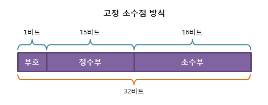
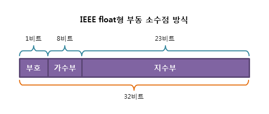
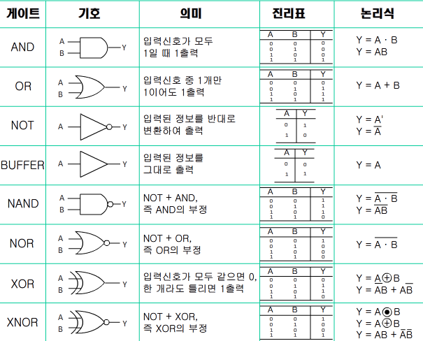
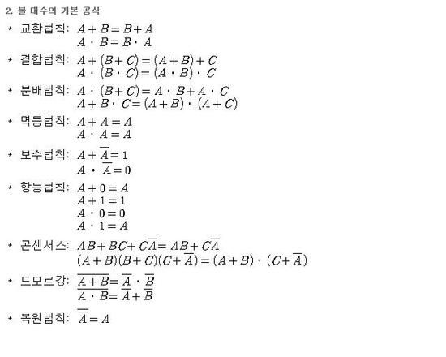

# 2018-04-13
## 컴퓨터의 구조
+ CPU, 주기억장치, 보조기억장치
---
### `CPU`
+ 제어 장치와 연산 장치, 레지스터로 나뉨
#### 제어장치 
1. 명령 해독기 : 명령 레지스터에 저장된 명령어를 해독하여 연산 장치나 입출력 장치 등의 실행에 필요한 `제어 신호`를 발생

2. 제어 신호 발생기 : 명령 해독기의 해독 결과에 따라 보내온 신호를 각 장치에 보냄 
#### 연산장치
1. 산술 연산 장치 : 산술 연산(`+ - * /`) 수행

2. 논리 연산 장치 : 논리 연산(`AND OR NOT XOR 등`) 수행
3. 누산기(`Accumulator`) : 산술연산 및 논리연산의 결과를 일시적으로 기억하는 레지스터
4. 보수기 : 뺄셈을 할 때 사용되는 `보수`를 만들어주는 논리회로
5. 데이터 레지스터 : 연산에서 사용되는 데이터가 `두 개 이상`인 경우, 기억장치에서 읽어와서 `일시적`으로 저장해 두는 레지스터
6. 상태 레지스터 : 연산을 처리한 결과 데이터 및 `결과값에 대한 상태` 저장
#### 레지스터
1. 프로그램 카운터(PC) : 현재 중앙 처리 장치로 읽어올 명령어의 `메모리 주소`가 저장

2. 명령 레지스터(IR) :  주기억 장치로부터 읽어온 명령어를 저장
3. MAR(Memory Address Register) : 데이터의 주소를 기억하는 레지스터
4. MBR(Memory Buffer Register) : 데이터를 임시로 기억하는 레지스터로 데이터를 처리하기 위해 반드시 거쳐감
---
### `주기억장치`
#### ROM (Read Only Memory)
+ 컴퓨터를 구동하기 위한 기본적인 정보가 담겨있음

+ 비휘발성
#### RAM (Random Access Memory)
+ 데이터를 저장시킬 수 있음(RWM)

+ 휘발성
+ MemoryStructure.md 참조
---
### `보조기억장치`
+ 휘발성이며 단위 용량당 가격이 높은 램(RAM)을 보조하기 위해 사용되는 기억 장치

+ HDD, SSD, 플래시 메모리 등 
---
## 이진법
+ 0과 1로 이루어짐

+ 더하기는 각 자리 똑같이 더함
+ 빼기는 2의 보수를 취한 후 더함
+ 나누기와 곱하기도 같음

### 표현법
+ 기본적인 변환법
```
56 -> 111000
37 -> 100101
85 -> 1010101
```

+ BCD 코드
```
56 -> 0101 0110
37 -> 0011 0111
85 -> 1000 0101
```
+ 3초과 코드 : BCD 코드의 연산 값에 0011(3)을 더해준 값

+ 그레이 코드 : 한 비트씩 변하는 특성
```
0110 => 0101
1101 -> 1011
0100 -> 0110
```
구하는 방법
1. 최상위 비트는 그대로 내림

2. 두번째 비트부터 자신과 그 앞자리에 놓인 비트를 XOR 시킴 
3. 2진수로 되돌리는 방법은 최상위 비트는 그대로 내리고 그 결과를 다음 비트와 XOR 함

### 이진수의 소수점 표현
#### 고정 소수점

+ 소수점의 위치가 특정 위치에 고정되어 있다고 가정하고 실수를 표현하는 방식

#### 부동 소수점

+ 소수점의 위치를 고정하지 않고 그 위치를 나타내는 수를 따로 적어내어 실수를 표현하는 방식

+ 표현할 수 있는 범위는 늘어나지만, 10진수를 정확하게 표현할 수는 없게 됨
```c++
int i;

float sum = 0.1;

 

for (i = 0; i < 1000; i++)

{

    sum += 0.1;

}

 

cout << "0.1을 1000번 더한 합계는 " << sum <<"입니다.";
```
```c++
실행결과
0.1을 1000번 더한 합계는 100.099입니다.
```
계산법
1. 정수부와 소수부를 분리하여 2진수로 바꿔줌

2. 2를 곱해서 0이 넘으면 1, 넘지 않으면 0으로 해서 나누어질 때 까지 반복
3. 부호비트는 양수면 0, 음수면 1
4. 지수부는 2의 승수 형태로 나타냄(127이 기본값)
5. 가수부는 맨 앞 1을 제외하고 왼쪽부터 채움(넘치면 생략, 부족하면 0으로 채움)

## 논리 연산
+ True, False 계산
### 계산

### 공식
