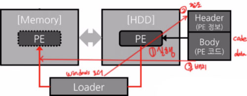

# Memory Structure

## Code 영역
+ `코드 자체`를 구성하는 메모리 영역으로 Hex파일이나 Bin파일 메모리

+ 프로그램 명령이 위치하는 곳으로 기계어로 제어되는 메모리 영역
+ 프로그램 실행 도중 변경 및 수정 불가능 (Read-Only)
## Data 영역
+ 프로그램의 `전역 변수, 정적 변수, 배열, 구조체` 등이 저장됨
+ 프로그램이 실행 될 때 생성되고 프로그램이 종료 되면 `시스템에 반환`됨

+ `메모리 접근 공간`으로 사용 가능 (프로그램 실행 중 접근 후 수정 및 변경 가능)
+ `초기화 된 데이터` 저장
## BSS 영역
+ `초기화 되지 않은 데이터` 저장
## Heap 영역
+ 프로세스가 사용할 수 있도록 미리 예약 되어 있는 공간

+ 메모리 주소 값에 의해서만 참조되고 사용되는 영역
+ 필요에 의해 `동적으로 메모리를 할당` 하고자 할 때 위치하는 메모리 영역
+ 실행 시간 임의의 지점에서 메모리를 할당/수거
## Stack 영역
+ 프로그램이 자동으로 사용하는 임시 메모리 영역

+ `지역 변수, 매개변수, 리턴` 값 등 잠시 사용되었다가 사라지는 데이터를 저장하는 영역 
+ `함수 호출 시 생성`되고, `함수가 끝나면 시스템에 반환`
+ 런타임 시에 스택 사이즈를 바꿀 수는 없음
+ stack영역에서의 주소 값은 시작 주소는 밑에서부터(먼저 선언된 순서) 그 다음 주소는 순서대로 정해짐
## Overflow 
1. **HEAP overflow** : heap이 위에서부터 주소값을 채워져 내려오다가 `stack영역을 침범`하는 경우

2. **STACK overflow** : stack영역이 `heap을 침범`
## Example Code
```c
int num = 1 ; // data(rw) 
int count; // bss 
char *str; // bss 
const int i = 10; // data(ro) 

int main () { // stack 생성
    int k, a = 1 // stack 

    char *ptr; // stack 

    ptr = malloc(4) // heap

    static int st_a; // bss -> 초기화 안된 변수

    static int st_b = 1; // data -> 초기화 된 변수 

    c = a+b; // code

    k = 2; // code 

    func (c, k); // stack 
    
    retrun 0 ; 
} // stack 소멸

void func (int test, int call) // stack 
{ 

} 
```
## Run time vs Compile
### 런타임이란?
+ 컴퓨터 과학에서 컴퓨터 프로그램이 실행되고 있는 동안의 동작을 말함

### 컴파일이란?
+ 어떤 언어의 코드를 다른 언어로 바꿔주는 과정

## 프로그램 실행 구조



+ PE 포맷 실행시 Windows의 로더가 PE헤더를 참고하여 PE 바디속의 코드와 데이터들을 메모리에 배치한다.