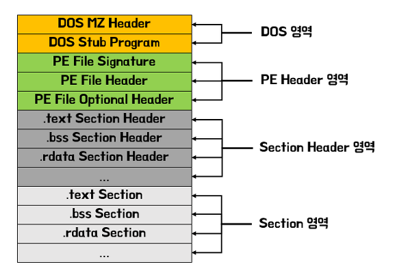
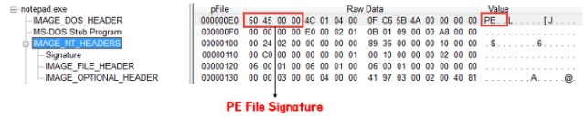

# 파일 형식(File Format)
## 파일 형식이란?
+ 저장을 목적으로 정보를 컴퓨터 파일로 인코딩하는 특별한 방식

+ 컴퓨터 디스크에 파일이 어떻게 표현되는가에 대한 명세
## 예시
+ **PNG 파일** => 무손실 데이터 압축을 사용하여 비트 맵 이미지를 저장

+ **다른 파일 형식** => 여러 가지 유형의 데이터를 저장하기 위해 설계
## 파일 유형 식별
1. **파일 이름 확장자**
> + 파일 이름 바꾸기만으로 파일을 다른 형식 으로 쉽게 처리 할 수 ​​있음
2. **내부 메타 데이터**
> + 파일 헤더와 매직 넘버 이용
3. **외부 메타 데이터**
> + 파일 자체가 아닌 파일 시스템에 형식에 대한 정보를 명시 적으로 저장

# PE 포맷(Portable Executable Format)
## PE 포맷이란?
+ Windows 운영체제에서 사용되는 실행 파일 형식
+ 파일을 실행하기 위한 모든 정보는 구조체 형식으로 PE 헤더에 저장되어 있음
+ 파일의 내용은 코드(.text), 데이터(.data), 리소스(.rsrc) 섹션에 나누어 저장
## 종류 
```
실행 계열 : exe, scr
라이브러리 계열 : dll, ocx, cpl, drv
드라이버 계열 : sys, vxd
오브젝트 파일 계열 : obj
```
## 구조

+ **PE Header** : `DOS Header ~ Section Header`
+ **PE Body** : PE헤더 이후 `Section들`

## Dos 영역
### DOS MZ HEADER
```
+ 프로그램 실행에 필요한 정보를 담고 있는 구조체 
Offset  Type    Description
0000h	c char	'MZ'(0x4d, 0x5a)
0002h	1 word	마지막 페이지(블록이라고도 한다)의 바이트 수. 한 페이지는 512바이트다.
0004h	1 word	파일에 있는 총 페이지 수.
0006h	1 word	재배치 항목의 수
0008h	1 word	단락 단위의 머리 크기. 한 단락의 16바이트다.
000Ah	1 word	파일에 포함된 실제 프로그램의 크기에 추가로 최소한 확보되어야 할 단락의 수
000Ch	1 word	최대로 확보되어야 할 단락의 수. 보통 최댓값인 65535인데, 이건 1M나 되기 때문에 남은 메모리가 모두 할당된다.
000Eh	1 word	Initial SS relative to start of executable
0010h	1 word	Initial SP
0012h	1 word	실행파일 체크섬 (또는 0)
0014h	1 word	IP relative to start of executable (entry point)
0016h	1 word	CS relative to start of executable (entry point)
0018h	1 word	재배치 정보표의 시작위치; 40h for new-(NE,LE,LX,W3,PE etc.) executable
001Ah	1 word	Overlay number (0h = 메인 프로그램)
```
### DOS Stub Program
+ 옵션적이고 크기도 일정하지 않음
+ 프로그램을 DOS 모드에서 실행시켰을 때 실행되는 코드
+ 딱히 필요 읎..
## NT Header
+ IMAGE_NT_HEADER 구조체는 3개의 멤버로 구성 => Signature, FileHeader, OptionalHeader
```c++
typedef struct _IMAGE_NT_HEADERS {
    DWORD Signature;
    IMAGE_FILE_HEADER FileHeader;
    IMAGE_OPTIONAL_HEADER32 OptionalHeader;
} IMAGE_NT_HEADER32, *PIMAGE_NT_HEADERS32;
```
### PE File Signature
+ PE영역의 시작을 알리는 값을 가지고 있는 영역
+ 모든 파일에서 그 값은 항상 동일함


### PE File Header
```c++
typedef struct _IMAGE_FILE_HEADER {
    WORD    Machine;
    WORD    NumberOfSections;
    DWORD   TimeDateStamp;
    DWORD   PointerToSymbolTable;
    DWORD   NumberOfSymbols;
    WORD    SizeOfOptionalHeader;
    WORD    Characteristics;
} IMAGE_FILE_HEADER, *PIMAGE_FILE_HEADER;
```
1. Machine
> + Machine 넘버는 CPU별로 고유한 값
2. NumberOfSections
> + PE 파일은 코드, 데이터, 리소스 등이 각각의 섹션에 나뉘어서 저장됨
> + 그 섹션들의 갯수
3. SizeOfOptionalHeader
> + IMAGE_OPTIONAL_HEADER32 구조체의 크기를 나타냄
> + IMAGE_OPTIONAL_HEADER32는 C언어의 구조체이기 때문에 크기가 결정되어 있는데, PE Loader는 SizeOfOptionalHeader 값을 보고 구조체의 크기를 인식
4. Characteristics
> + 파일의 속성을 나타내는 값
> + 실행이 가능한 형태인지, DDL파일인지 등의 정보들이 bit OR 형식으로 조합됨
5. TimeDateStamp
> + 파일의 실행에 영향을 미치지 않음
> + 해당 파일의 빌드 시간을 나타낸 값   
### PE File Optional Header
+ 구조체 중에서 가장 크기가 큼
```c++
typedef struct _IMAGE_DATA_DIRECTORY {
	DWORD VirtualAddress;
	DWORD Size;
} IMAGE_DATA_DIRECTORY,*PIMAGE_DATA_DIRECTORY;

#define IMAGE_NUMBEROF_DIRECTORY_ENTRIES     16
typedef struct _IMAGE_OPTIONAL_HEADER {
	WORD    Magic;
	BYTE    MajorLinkerVersion;
	BYTE    MinorLinkerVersion;
	DWORD   SizeOfCode;
	DWORD   SizeOfInitializedData;
	DWORD   SizeOfUninitializedData;
	DWORD   AddressOfEntryPoint;
	DWORD   BaseOfCode;
	DWORD   BaseOfData;
	DWORD   ImageBase;
	DWORD   SectionAlignment;
	DWORD   FileAlignment;
	WORD    MajorOperatingSystemVersion;
	WORD    MinorOperatingSystemVersion;
	WORD    MajorImageVersion;
	WORD    MinorImageVersion;
	WORD    MajorSubsystemVersion;
	WORD    MinorSubsystemVersion;
	DWORD   Reserved1;
	DWORD   SizeOfImage;
	DWORD   SizeOfHeaders;
	DWORD   CheckSum;
	WORD    Subsystem;
	WORD    DllCharacteristics;
	DWORD   SizeOfStackReserve;
	DWORD   SizeOfStackCommit;
	DWORD   SizeOfHeapReserve;
	DWORD   SizeOfHeapCommit;
	DWORD   LoaderFlags;
	DWORD   NumberOfRvaAndSizes;
	IMAGE_DATA_DIRECTORY DataDirectory[IMAGE_NUMBEROF_DIRECTORY_ENTRIES];
} IMAGE_OPTIONAL_HEADER,*PIMAGE_OPTIONAL_HEADER;
```

1. Magic
> + IMAGE_OPTIONAL_HEADER32인 경우 10Bh, IMAGE_OPTIONAL_HEADER64인 경우 20Bh 값을 가짐
2. AddressOfEntryPoint
> + Entry Point의 Relative Virtual Address 값을 가지고 있음
3. ImageBase
> + 메모리 내에서 PE파일이 로딩되는 시작 주소를 나타냄
4. SectionAlignment, FileAlignment
> + 파일과 메모리에서 섹션의 최소 단위를 나타냄
5. SizeOfImage
> + PE 파일이 메모리에 로딩되었을 때 가상 메모리에서 PE Image가 차지하는 크기를 나타냄
6. SizeOfHeader
> + PE Header의 전체 크기를 나타냄
7. Subsystem
> 1. Driver File (*.sys)
> 2. GUI 파일 -> notepad.exe와 같은 윈도우 기반 어플리케이션
> 3. CUI 파일 -> cmd.exe와 같은 콘솔 기반 어플리케이션
8. NumberOfRvaAndSizes
> + DataDirectory 배열의 갯수
9. DataDirectory
> + 구조체의 배열로써, 배열의 각 항목마다 정의된 값을 가짐


## Section Header
+ 각 섹션의 속성을 정의
```c++
#define IMAGE_SIZEOF_SHORT_NAME

typedef struct _IMAGE_SECTION_HEADER {
	BYTE Name[IMAGE_SIZEOF_SHORT_NAME];
	union {
		DWORD PhysicalAddress;
		DWORD VirtualSize;
	} Misc;
	DWORD VirtualAddress;
	DWORD SizeOfRawData;
	DWORD PointerToRawData;
	DWORD PointerToRelocations;
	DWORD PointerToLinenumbers;
	WORD NumberOfRelocations;
	WORD NumberOfLinenumbers;
	DWORD Characteristics;
} IMAGE_SECTION_HEADER,*PIMAGE_SECTION_HEADER;
```
### 중요 멤버
1. VirtualSize
> + 메모리에서 섹션이 차지하는 크기
2. VirtualAddress
> + 메모리에서 섹션의 시작 주소 (RVA)
3. SizeOfRawData
> + 파일에서 섹션이 차지하는 크기
4. PointerToRawData
> + 파일에서 섹션의 시작 위치
5. Characteristics 
> + 섹션의 특징 (bit OR)
## Section 영역
+ .text = 프로그램의 Code 관련 정보가 들어 있는 섹션

+ .rdata : Const로 선언된 변수, 변수로 사용되지 않는 String 
+ .data : Const를 제외한 전역 변수, Static으로 선언된 지역 변수
+ .idata  = IAT에 관련된 정보들이 존재 하는 섹션
+ .edata = EAT에 관련된 정보들이 존재 하는 섹션
+ .reloc  = PE파일의 Relocate 정보를 담고 있는 섹션